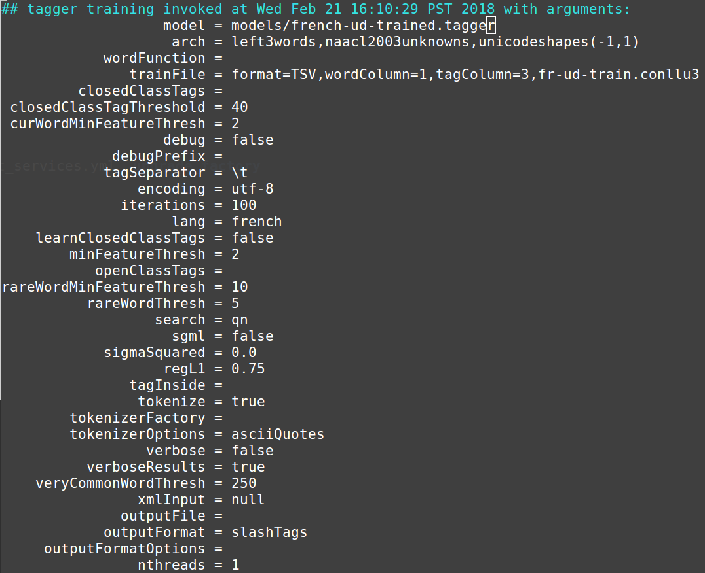

## Rapport labo2 TAL 
​	Authors : Johanna Melly & Yohann Meyer

### 1
 1. Quel est le format du fichier?

    C'est un fichier en format CoNLL-U. Dans ce format, chaque ligne se réfère à un mot et chaque colonne apporte une information sur ce mot (forme, racine, id...)

 2. Dans quelles colonnes se trouvent les mots et leur POS-tag?

    Respectivement en colonne 1 et 3. 

    ### 2b

      Commande utilisée: 

    ```bash
      java -classpath stanford-postagger.jar edu.stanford.nlp.tagger.maxent.MaxentTagger -prop french-ud.tagger.props
    ```

     Voici la configuration qui a permis l'évaluation:  

      

    Résultat pour le fichier test:

    

    Résultat pour le fichier dev:

    

    On observe un grand pourcentage d'erreur.

    ### 3

      Commande utilisée pour entraîner le fichier:

    ```bash
      java -classpath stanford-postagger.jar edu.stanford.nlp.tagger.maxent.MaxentTagger -prop french-ud.tagger.props
    ```

      Le fichier de propriétés est le suivant:

    

L'évaluation avec le nouveau modèle a réduit considérablement le pourcentage d'erreurs.

Résultat pour le fichier test:


Résultat pour le fichier dev:


